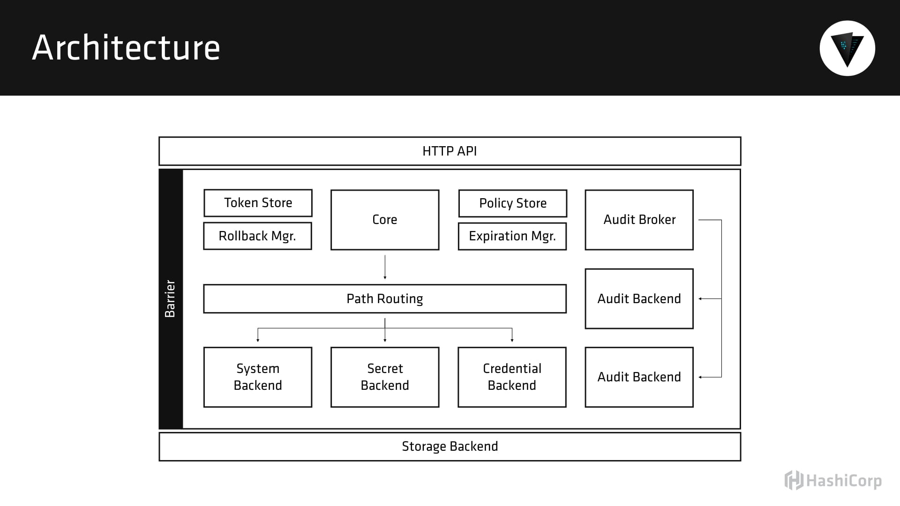
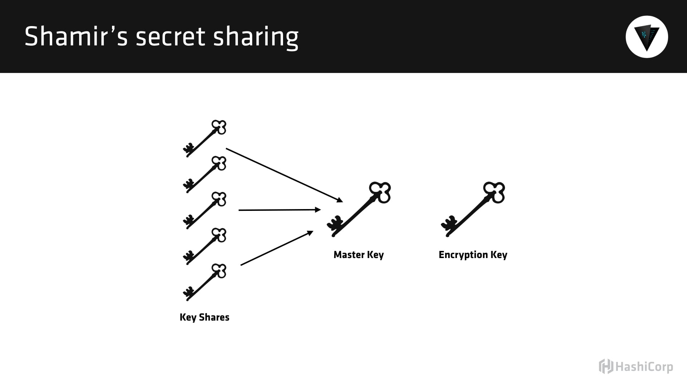
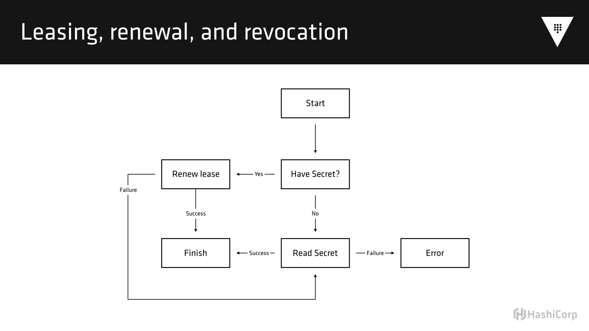

# Managing Secrets with Chef and HashiCorp's Vault (Webinar 11/22/2016)

This repository contains all the materials and outline for my November 22, 2016 Webinar [Managing Secrets with Chef and HashiCorp's Vault](https://www.chef.io/blog/event/webinar-manage-secrets-with-chef-and-hashicorps-vault/). This outline was written in advance of the webinar, so questions or digressions may not be captured here. Please watch the webinar for the full context.

These configurations use Vault 0.6.2, but the concepts should be largely applicable to most Vault releases.

**These are NOT best practices Terraform configurations or Vault setup. These are for demonstration purposes only and should not be used in production.**

## Overview

- **Q: What is a secret?***

Anything which, if acquired by an unauthorized party could cause political, financial, or reputation harm (to an organization).

- **Q: How long is a secret a secret?**

We frequently rotate things like login credentials, but when is the last time you changed your WIFI password?

- **Q: What is the current process for acquiring a database credential for an application in your organization?**

For small companies, this might involving SSHing into a server, copy-pasting a command from StackOverflow, and then putting the credentials in a text file. For larger companies, you file a JIRA ticket, wait 6-8 weeks, and have the credential emailed to you.

This webinar explores a hypothetical scenario involving that last process - acquiring a database credential and placing it into a YAML file so our application can communicate with the database.

## The (Current) Past

It is helpful to identify a few existing patterns and techniques, some of which you may already be using.

_Presenter note:_ Change into `chef/` directory.

#### Directly in the Recipe

More commonly known as "YOLO-mode", you just put the credential in plaintext in the recipe, check it into source control, and trust the SCM gods to keep it safe.

```sh
$ vi cookbooks/direct/recipes/default.rb
```

```sh
$ chef-client -z -r 'recipe[direct]'
```

This is problematic for obvious reasons, most importantly that the credentials are visible to anyone with access to the Chef repository.

#### Node Attributes

For sensitive information, you may store things in node attributes. Since I am using "local" mode, I am going to fake it here, but you could surround these node attributes with ACLs to prevent prying eyes.

```sh
$ vi cookbooks/attrs/recipes/default.rb
```

```sh
$ chef-client -z -r 'recipe[attrs]'
```

Some of the problems with node attributes include:

- Stored in plaintext on the server
- Relies on ACLs instead of encryption

#### Encrypted Data Bags

One of the most common patterns for handling sensitive data in the Chef ecosystem is encrypted data bags, which requires a shared secret across all the nodes in the cluster to decrypt secret data.

```sh
$ vi data_bags/secrets/postgresql.json
```

```sh
$ vi cookbooks/encrypted-databags/recipes/default.rb
```

```sh
$ chef-client -z -r 'recipe[encrypted-databags]'
```

Some of the problems with encrypted data bags include:

- Lack of auditing
- Same shared secret across all nodes (if a credential is leaked, how do we find out _who_ leaked it)
- Infinite credential lifetime
- Requires "manual" intervention (a human must generate the credential and encrypt it)

#### Chef-Vault

Of note is a great Chef extension by the folks at Nordstrom called "chef-vault". This tool is in no way associated with HashiCorp Vault which we are discussing today, but chef-vault does provide a pure-Chef implementation for generating per-node secrets. However, it still has the following problems:

- Lack of auditing
- Infinite credential lifetime
- Requirement for manual credential generation

## The Problems

To summarize from the problems from the previous techniques:

- Storing secrets in plaintext
- Reliance on ACLs instead of encryption
- Lacking of auditing/visibility
- Lack of per-node or per-client secrets
- Infinite credential lifetime
- Requirement for operator insertion

HashiCorp Vault is designed to solve these and many additional secret management problems. Vault provides a single source of truth for secrets and credential management in an organization. It provides programatic access for machines to authenticate and generate their own credentials, and it provides operator access for humans to authenticate and generate credentials. The entire system is controlled via fine-grained ACLs and policies to grant particular users, groups, or machines access to information in the Vault.

By being a single source of truth, Vault provides "Secrets as a Service", allowing machines and humans to authenticate against it via the HTTP API.

Let's take a look at Vault's architecture and design outside of the scope of Chef, and then we will bring the tools together to see how they interoperate.

## HashiCorp Vault Architecture and Overview



(Explain Vault's architecture)



(Explain Shamir's secret sharing algorithm)

Vault can run in high-availability mode, but I am only running a single instance for this webinar.

There are other authentication mechanisms for Vault, including username-password, GitHub, LDAP, and more.

### Static Secrets

There are two kinds of secrets in Vault - static and dynamic. Dynamic secrets have enforced leases and usually expire after a short period of time. Static secrets have refresh intervals, but they do not expire unless explicitly removed.

The easiest way to think about static secrets is "encrypted redis" or "encrypted memcached". Vault exposes an encrypted key-value store such that all data written is encrypted and stored.

Let's go ahead and write, read, update, and delete some static secrets:

```sh
$ vault write secret/foo value=my-secret-value
```

```sh
$ vault read secret/foo
```

```sh
$ vault write secret/foo value=new-secret author=sethvargo
```

```sh
$ vault read secret/foo
```

```sh
$ vault list secret/
```

Static secrets in Vault solve the majority of the problems listed above except for:

- Lack of per-node/clients secrets
- Infinite credential lifetime
- Requirement for operator insertion

Dynamic secrets (sometimes called the "secret acquisition engine") can alleviate the remaining problems.

### Dynamic Secrets

Vault can act as the "root" user to many databases and services to dynamically generate sub-accounts based on a configured policy or role. Let's take a moment to look at AWS as an example.

Suppose your are a developer who needs access to communicate with the AWS APIs. Normally someone with privileged access would need to:

- login to the AWS console
- create your credentials with the proper permissions
- securely distribute your credentials

With Vault, we can automate the policies and configuration automatically based on a rules and configurations. We give Vault a privileged AWS account with permissions to create other credentials and map that to a series of AWS policies. Now developers can programmatically access AWS credentials without human intervention.

```sh
$ vault read aws/creds/developer
```

Because this process is codified, there is very little room for human error. Additionally, this path can be tightly restricted via ACLs and those ACLs can be mapped to policies. This allows a Vault administrator to grant authorization based on authentication, such as:

- Anyone in the "engineers" team in the "hashicorp" GitHub organization
- Anyone in the OU "devs" in the company LDAP server

You may have noticed those credentials have a "lease_duration" of 2 minutes. Unless renewed before 2 minutes, the credential will expire. In this way, Vault's dynamic secret backend behaves similarly to IP leases via DHCP.

Acquiring AWS credentials is most a human-based operation. Let's take a look at generating PostgreSQL credentials, which might be more of a machine-based operation.

To save time, I have already configured this Vault server to connect to our PostgreSQL database in advance. To generate a new credential, we simply ask Vault:

```sh
$ vault read postgresql/creds/readonly
```

This will generate a username and password to a PostgreSQL server that has readonly access to a database.

Each time we read from this path, Vault connects to the PostgreSQL server and executes the SQL required to generate a new credential. These credentials are valid for the configured lease, which is 2 minutes, at which point they must be renewed. After a configurable maximum lease interval, the credential will be revoked, even if it was renewed.

## API

Almost all interactions in Vault take place via the HTTP API. The CLI is actually just a very thin wrapper around the HTTP API that provides JSON parsing and table formatting. There is nothing you can do with the CLI that cannot be done via the API.

Here is an example of using the API to generate a PostgreSQL credential:

```sh
$ curl -s -H "X-Vault-Token: $VAULT_TOKEN" https://vault.hashicorp.rocks/v1/postgresql/creds/readonly | jq .
```

```json
{
  "auth": null,
  "warnings": null,
  "wrap_info": null,
  "data": {
    "username": "token-4c56d5ba-b380-efe4-9dc6-8be290bc2291",
    "password": "0bb9ca18-62b0-8a7e-04d8-31b1f85d937c"
  },
  "lease_duration": 120,
  "renewable": true,
  "lease_id": "postgresql/creds/readonly/58f2e3fd-141c-b33d-7c3a-52fdc5f27523",
  "request_id": "2c234805-5af1-ef93-5067-190fc9bf3123"
}
```

Because Vault has a full API, almost any tool which can make HTTP requests is able to communicate with Vault, including Chef.

## Querying Vault from Chef

Chef is written in Ruby. Chef has its own primitives for making HTTP requests. By combining `remote_file` and `ruby_block`, we can achieve the same behavior as before, but by querying the Vault API directly from Chef:

```sh
$ vi cookbooks/api/recipes/default.rb
```

```sh
$ chef-client -z -r 'recipe[api]'
```

Great, we just used Chef to programmatically query the Vault API to generate a PostgreSQL credential and stored that in a file on disk for our application to access. Because of Vault's design, each Chef node will receive a _different_ credential.

In Vault's architecture, nodes and applications using credentials must renew those credentials before the lease duration expires. Failure to renew credentials before the lease expires results in the credential being revoked.



This means applications wishing to integrate with Vault must implement this control flow and credential renewal lifecycle. It is challenging to get this correct, and it requires a daemon-like process on the system. For this reason, configuration management is usually not the best place to manage this lifecycle. In particular, it would be impossible to have short-lived secrets under this model, because they would expire before the configuration management tool could renew them.

Fortunately applications do not need to implement this flow either. There are open source tools which exist to implement this control flow for you, making it transparent to your applications and configuration management tooling.


These applications, sometimes called "sidecars", handle the communication between different processes, presenting a common and predictable API to subsystems. One of those tools is named "Consul Template".

Does this mean configuration management is dead? Absolutely not. We still need Chef to install and configure Consul Template for us. Chef can also start the Consul Template service and ensure it stays running over time.

```sh
$ vi cookbooks/ct/recipes/default.rb
```

```sh
$ sudo chef-client -z -r 'recipe[ct]'
```

Chef successfully downloaded, unarchived, and installed Consul Template as a system service. We can look at the logs to make sure:

```sh
$ sudo tail -f /var/log/upstart/consul-template.log
```

Chef and Vault are playing harmoniously playing together through Consul Template.

## Interactivity

Up until this point, I have been doing everything as the root user, and you have been sitting there listening. Everything in Vault is path and policy-based, and the root user has access to all paths and policies.

Humans and machines authenticate to Vault using pieces of information in exchange for a token. That token, similar to a session token on a website, is mapped to permissions in Vault based on their authentication.

I created a policy in advance that only permits generating only readonly credentials in Vault. Visit the following URL in your browser to get a Vault token and the associated command to generate credentials.

    https://vault.hashicorp.rocks/app

Notice that you can only generate database credentials; you will not be able to access the generic secret backend or generate AWS credentials.

## Deployment Strategies

In this webinar, I used Terraform to provision a Vault cluster, but there are many techniques for deploying Vault including Chef, Nomad, Kubernetes, Cloud Foundry, and Chef's own [habitat](https://habitat.sh). To talk more about Habitat and the Vault Habitat creation process, I would like to turn it over to JJ Asghar from Chef. JJ, please take it away.
